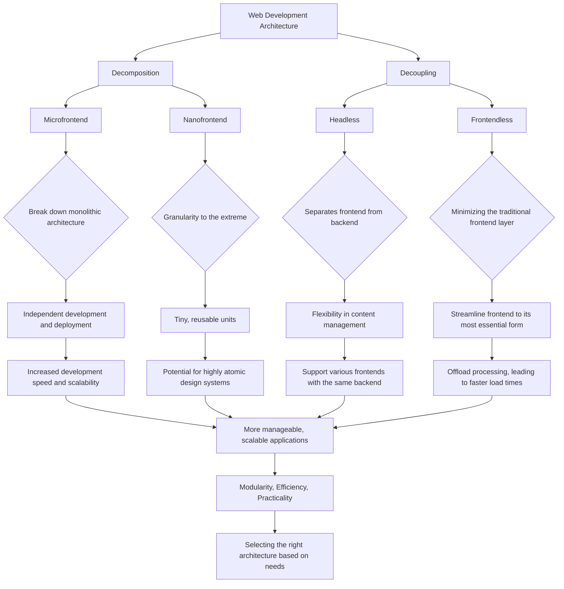

# frontend - Interface-Centric Solutions - nanoFrontends.com: Modular/Atomized Streamed Interface

Two strategies from the frontside perspective, "Decomposition" and "Decoupling," illuminate the evolving landscape of web development architecture. 
These strategies highlight the industry's movement towards more modular, flexible, and efficient approaches to building web applications, the balance between modularity, efficiency, and the practicalities of application development and maintenance. 
Each approach offers unique advantages and challenges, underscoring the importance of selecting the right architecture based on the specific needs and goals of a web project.

Both the decomposition and decoupling strategies underscore a broader trend towards more specialized, efficient, and flexible architectures in web development. By breaking down monolithic structures, whether through microfrontends or the more theoretical nanofrontends, developers can create more manageable, scalable applications. On the other hand, decoupling strategies like headless and frontendless architectures offer different angles on separating concerns, enhancing content delivery, and optimizing performance.

Below is a Mermaid graph that visualizes the content described above regarding the two strategies from the frontside perspective: 
Decomposition and Decoupling, along with their sub-strategies and implications for web development architecture.

Below is an exploration of each strategy and how they reflect current trends in web development.

## Decomposition

### Microfrontend
This approach is about breaking down the traditional monolithic frontend architecture into smaller, independent applications that can be developed, deployed, and scaled independently. This strategy allows different teams to work on different aspects of the frontend using potentially different technologies that best suit their microfrontend, leading to increased development speed and better scalability. It caters to more complex projects where different functionalities can be distinctively separated and developed in parallel.

### Nanofrontend
Going a step further, the nanofrontend concept pushes the envelope of granularity by treating individual components or even smaller elements as separate entities. This could mean having tiny, reusable, and independently deployable units for UI elements like buttons, forms, or navigation bars. While this approach can theoretically maximize modularity and flexibility, it also introduces complexities in terms of integration and consistency across the application. Nanofrontends highlight an extreme take on modular architecture, emphasizing the potential for highly atomic design systems.

## Decoupling

### Headless
The headless architecture decouples the frontend (the "head") from the backend, giving developers the freedom to use any frontend technology to build the UI, while the backend is reduced to an API layer. This separation allows for greater flexibility in content management and delivery, as the backend focuses on delivering content through APIs, and the frontend is responsible for presenting this content to the user. Headless architecture is particularly effective in scenarios where the same backend services need to support various frontends, such as web, mobile, and IoT devices.

### Frontendless
This concept narrows down the focus on minimizing the traditional frontend layer, leveraging server-side rendering or compiling to minimal client-side code. The goal is to offload as much processing as possible to the backend or to compile-time operations, leading to faster load times and potentially smaller application sizes. Unlike the headless approach, which purely emphasizes decoupling, frontendless strategies may still rely on tight integration with backend services but look to streamline the frontend to its most essential form.

## keywords

+ Software Architecture Patterns
+ Design Patterns
+ Decomposition and Decoupling specifically focus on structuring and organizing code to make it more reusable, maintainable, scalable, and adaptable to change, which are key objectives in software architecture.
+ web applications
+ front-end development
+ Front-End Architecture Patterns
+ Web Development Architecture Strategies
+ client-side perspective

---
+ [edit](https://github.com/modware-org/frontend/edit/main/README.md)
